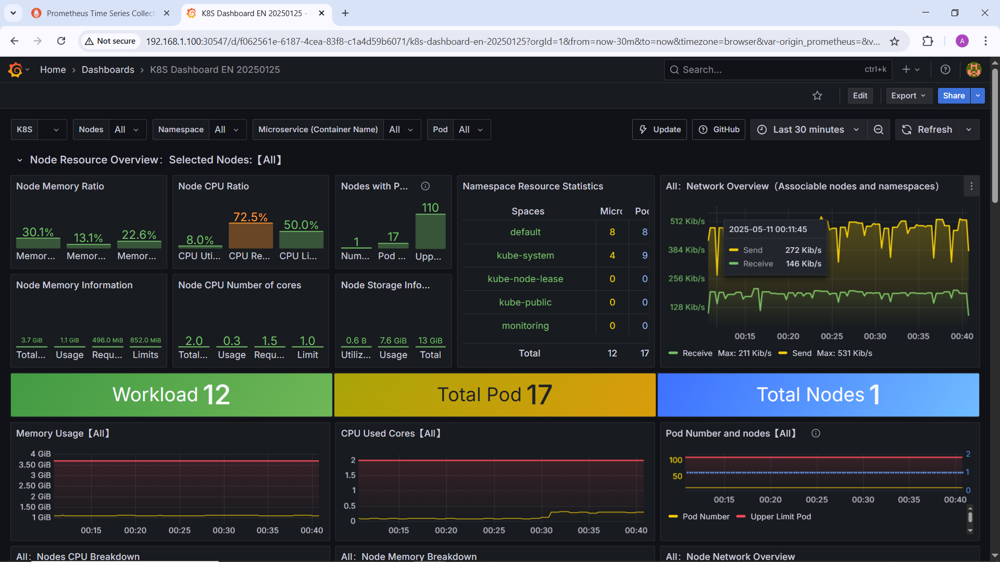
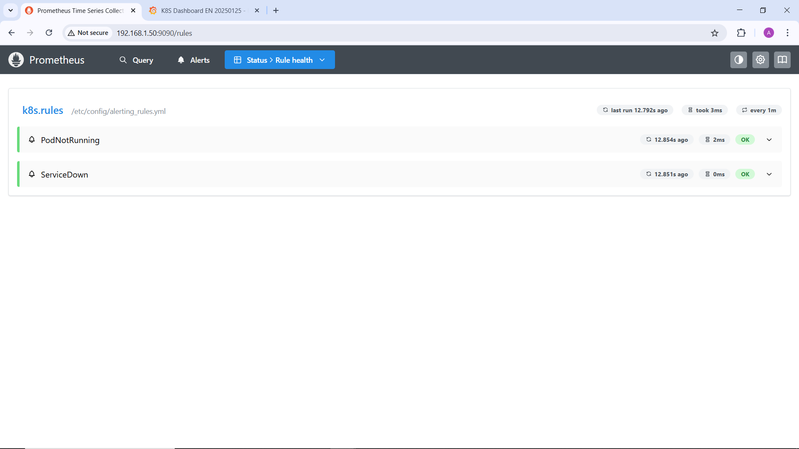

# 📊 Kubernetes Monitoring Stack with Prometheus & Grafana

This project sets up a monitoring stack in Kubernetes using **Prometheus** and **Grafana**, deployed via **Helm**. It includes custom Prometheus alert rules for detecting issues like non-running pods and unavailable services.

---

## 🚀 What’s Included

- 📦 `prometheus` & `grafana` Installed via Helm chart
- 📊 Grafana dashboards for cluster and application metrics
- ⚠️ Custom alert rules:
  - `PodNotRunning`: Alerts when any pod is not in a "Running" state
  - `ServiceDown`: Alerts if a service endpoint is missing

---

## 📁 Project Structure

```bash
.
├── README.md
├── screenshots
│   ├── grafana-dashboard.png
│   └── prometheus-rules.png
└── values.yaml
```

---

## 🔧 Installation Steps

1. Add the Helm repo and update:
```bash
helm repo add prometheus-community https://prometheus-community.github.io/helm-charts
helm repo add grafana https://grafana.github.io/helm-charts
helm repo update
```
2. Install the stack with custom values:
```bash
helm install prometheus prometheus-community/kube-prometheus-stack -n monitoring --create-namespace -f values.yaml
helm install grafana grafana/grafana -n monitoring --create-namespace --set adminPassword='grafanaPass'
```
3. Port forward Prometheus and Grafana to access the dashboard:
```bash
kubectl port-forward svc/prometheus-server -n monitoring 9090:80 &
kubectl port-forward svc/grafana -n monitoring 9000:80 &
```
4. Visit http://localhost:9000 \
Default credentials: admin / grafanaPass

---

## 📊 Screenshots

| Grafana Dashboard                        | Prometheus Rules                        |
| ---------------------------------------- | --------------------------------------- |
|  |  | 


---

## 📁 values.yaml Snippet (Alerts)

```yaml
alertingRules:
    rules:
        - alert: PodNotRunning
        expr: 'kube_pod_status_phase{phase="Running", namespace="todo-app"} < 2'
        for: 2m
        labels:
            severity: warning
        annotations:
            summary: "Pod is not running"
            description: "Pod {{ $labels.pod }} in namespace {{ $labels.namespace }} is in phase {{ $labels.phase }}"
        - alert: ServiceDown
        expr: 'kube_endpoint_address_available{namespace="todo-app"} == 0'
        for: 1m
        labels:
            severity: critical
        annotations:
            summary: "Service has no endpoints"
            description: "Service {{ $labels.service }} in namespace {{ $labels.namespace }} has no available endpoints"
```

---

## 🧠 Lessons Learned

. Using Helm simplified installation and updates
. Alert rules can catch problems before users notice them
. Monitoring is critical for reliability and uptime

---

## 🙌 Author

Ahmed Elhgawy – [GitHub](https://github.com/Ahmed-Elhgawy) | [LinkedIn](https://linkedin.com/in/ahmed-mahmoud-a16310268)
